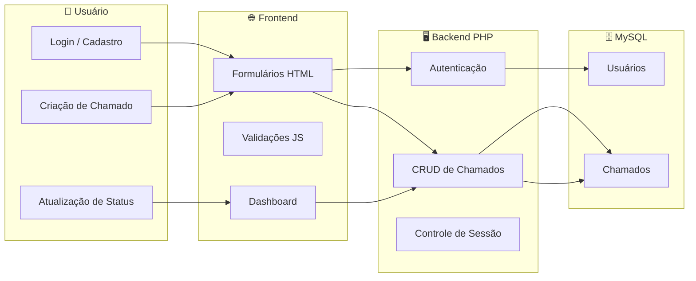

# 📋 Sistema de Gestão de Chamados – Projeto Web


---

Este repositório contém um **Sistema de Gestão de Chamados**, desenvolvido como projeto prático para organização e acompanhamento de demandas internas, inspirado em ferramentas como **Asana** e sistemas de **Service Desk**.

O sistema permite **criar, atribuir, acompanhar e finalizar chamados**, mantendo histórico, responsáveis e status, sendo aplicável a **equipes de TI, setores administrativos ou ambientes educacionais**.

---

## 🎯 Objetivo do Sistema

- Centralizar a criação e acompanhamento de chamados  
- Organizar tarefas por status e responsável  
- Facilitar o controle de demandas internas  
- Oferecer uma visão clara do andamento dos trabalhos  
- Servir como base para evolução em sistemas de Help Desk / ITSM  

---

## 🚀 Funcionalidades Principais

### 👤 **Autenticação de Usuários**
- Cadastro e login de usuários  
- Senhas armazenadas com **hash seguro (bcrypt)**  
- Controle de sessão para acesso às rotas protegidas  

---

### 📋 **Gestão de Chamados**
- Criação de chamados com:
  - Título  
  - Descrição  
  - Responsável  
- Edição de informações e status  
- Exclusão de chamados com confirmação  
- Visualização detalhada de cada chamado  

---

### 📊 **Dashboard**
- Listagem geral de chamados  
- Contadores por status  
- Visão rápida do andamento das demandas  

---

### 🔎 **Busca e Filtros**
- Pesquisa por título ou descrição  
- Filtro por status do chamado  

---

## 🔄 Status dos Chamados

| Status | Descrição |
|------|-----------|
| 🟡 **Aberto** | Chamado recém-criado, aguardando atendimento |
| 🔵 **Em Andamento** | Chamado em processo de resolução |
| 🟢 **Concluído** | Chamado finalizado |

---

## 🛠 Tecnologias Utilizadas

### **Backend**
- PHP 7.4+  
- PDO para acesso ao banco de dados  
- Sessões PHP para controle de autenticação  

### **Banco de Dados**
- MySQL 5.7+  
- Estrutura relacional para usuários e chamados  

### **Frontend**
- HTML5  
- CSS3  
- JavaScript  

### **Ambiente de Desenvolvimento**
- Laragon / XAMPP  
- Git & GitHub  

---

## 📁 Estrutura do Projeto

```bash
gestao/
├─ index.php            # Redirecionamento inicial
├─ login.php            # Autenticação
├─ cadastro.php         # Registro de usuários
├─ logout.php           # Encerramento de sessão
├─ dashboard.php        # Painel principal
├─ create_chamado.php   # Criação de chamados
├─ view_chamado.php     # Visualização detalhada
├─ edit_chamado.php     # Edição de chamados
├─ delete_chamado.php   # Exclusão
├─ setup.php            # Criação automática do banco
├─ database.sql         # Script SQL
│
├─ db/
│ └─ conexao.php        # Conexão PDO
│
├─ css/
│ └─ style.css          # Estilos
│
├─ js/
│ └─ main.js            # Scripts JavaScript
│
└─ README.md
```
---

### 🧩 Arquitetura do Sistema



## 🔐 Segurança

- ✔ Senhas criptografadas com `password_hash()`  
- ✔ Queries preparadas com **PDO** (proteção contra SQL Injection)  
- ✔ Escape de saída com `htmlspecialchars()` (proteção contra XSS)  
- ✔ Rotas protegidas por sessão  

---

## 🚧 Possíveis Evoluções

- Comentários em chamados  
- Upload de anexos  
- Níveis de prioridade (Alta, Média, Baixa)  
- Notificações por e-mail  
- Relatórios e gráficos  
- API REST para integração com outros sistemas  
- Histórico de alterações nos chamados  

---

## 🧑‍💻 Autor

**Ricardo Quadros**  
- Estudante de Engenharia da Computação – UERGS  
- Técnico em Informática – E.E.E.M. Dr. Solon Tavares  
- Estagiário de Tecnologia da Informação – Prefeitura de Guaíba  
- Guaíba, RS – Brasil  

---

## 📫 Contato

- GitHub: https://github.com/ricardaoquadros-jpg  
- Email: ricardaoquadros@gmail.com  
- LinkedIn: https://www.linkedin.com/in/ricardopquadros/
